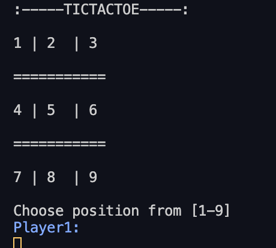
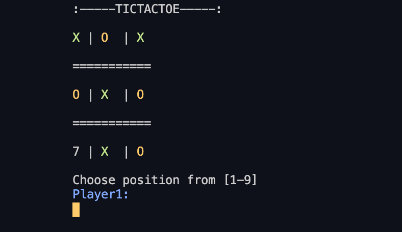

# Tictactoe Testing

> Tictactoe Game

## Built With

- Ruby
- Tested with `rspec` 

## Getting Started for testing

- In order to test it make sure to install `rspec`.
- Run command `bundle install`
- Run command `rspec`
- Testing cases for each class is on ***spec/*** folder. 

## Authors

👤 **Fernando**

- Github: [@Ferm0494](https://github.com/Ferm0494)
- Twitter: [@ferm494](https://twitter.com/ferm494)
- Linkedin: [@Ferm0494](https://www.linkedin.com/in/ferm0494/)

👤 **Paul**

- Email: [ajuzepaul@gmail.com](ajuzepaul@gmail.com)
- Github: [@misterpaul4](https://github.com/misterpaul4)
- Twitter: [@paulajuze](https://twitter.com/paulajuze)
- Linkedin: [Chukwuebuka Paul Ajuizeogu](https://www.linkedin.com/in/chukwuebuka-paul-ajuizeogu/)

## 🤝 Contributing

Contributions, issues and feature requests are welcome!

Feel free to check the [issues page](issues/).

## Show your support

Give a ⭐️ if you like this project!

## 📝 License

This project is [MIT](lic.url) licensed.
