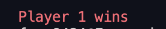

# Tictactoe

> Tictactoe Game

## Built With

- Ruby

## Getting Started

- Download the repo and navigate to the folder bin.
- Open the terminal on bin folder and type `ruby main`
- Make sure to put only inputs from [1-9]
- You can type  ANY `NEGATIVE NUMBERS` in order to finish the program.

## Authors

👤 **Fernando**

- Github: [@Ferm0494](https://github.com/Ferm0494)
- Twitter: [@ferm494](https://twitter.com/ferm494)
- Linkedin: [@Ferm0494](https://www.linkedin.com/in/ferm0494/)

👤 **Paul**

- Email: [ajuzepaul@gmail.com](ajuzepaul@gmail.com)
- Github: [@misterpaul4](https://github.com/misterpaul4)
- Twitter: [@paulajuze](https://twitter.com/paulajuze)
- Linkedin: [Chukwuebuka Paul Ajuizeogu] (https://www.linkedin.com/in/chukwuebuka-paul-ajuizeogu/)

## 🤝 Contributing

Contributions, issues and feature requests are welcome!

Feel free to check the [issues page](issues/).

## Show your support

Give a ⭐️ if you like this project!

## 📝 License

This project is [MIT](lic.url) licensed.
